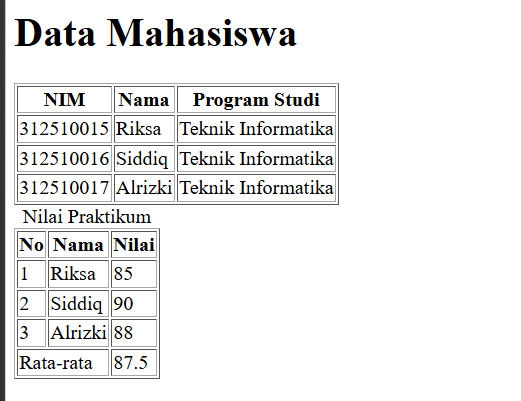
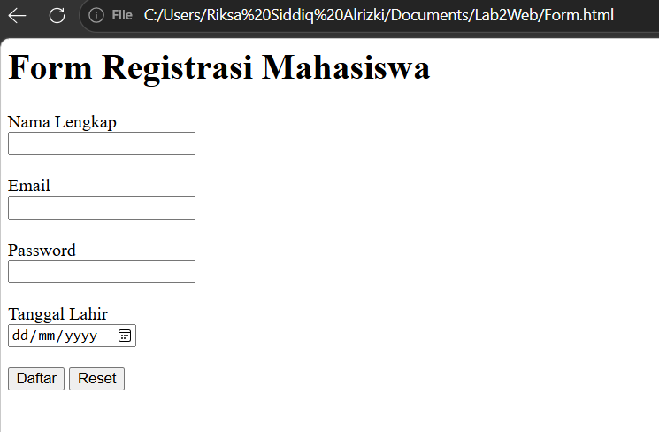
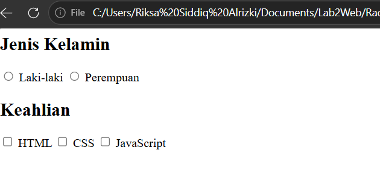
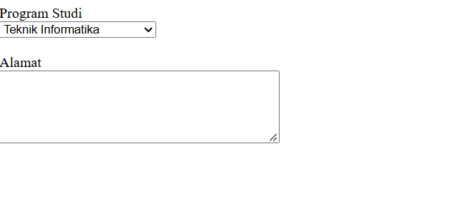
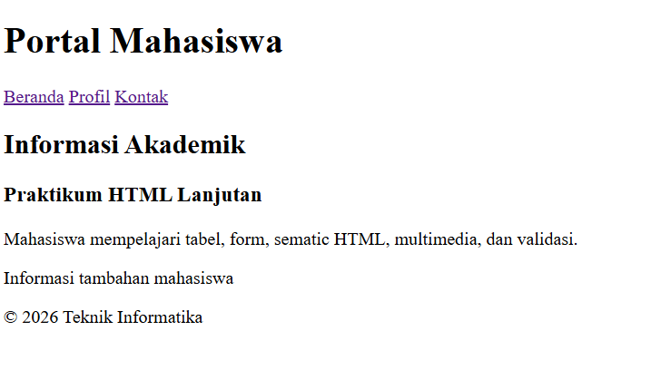
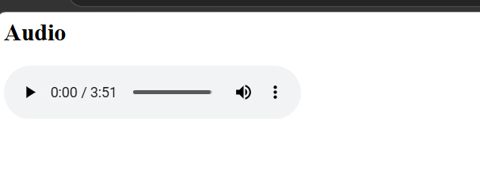

# Praktikum 2 – HTML Lanjutan

Mata Kuliah: Pemrograman Web
Nama: Riksa Siddiq Alrizki
NIM: 312510015
Kelas: I253A
Program Studi: Teknik Informatika

## Deskripsi

Praktikum ini membahas HTML tingkat lanjut, yaitu tabel, form, validasi form, semantic HTML, dan multimedia (audio). Seluruh file dibuat dengan HTML murni dan dibuka langsung melalui browser.

## penjelasan Praktikum

### 1. Membuat Tabel Data Mahasiswa

Tabel dibuat dengan tag `<table>`. Setiap baris memakai `<tr>`, judul kolom memakai `<th>`, dan isi sel memakai `<td>`. Atribut `border="1"` dipakai agar garis tabel terlihat. Tabel berisi kolom NIM, Nama, dan Program Studi, dengan tiga data mahasiswa.

**Screenshot Hasil:**  

### 2. Mengembangkan Tabel dengan `thead`, `tbody`, dan `tfoot`

Tabel dibagi menjadi tiga bagian agar strukturnya jelas:

- `<caption>` : judul tabel ("Nilai Praktikum").
- `<thead>` : bagian kepala tabel (No, Nama, Nilai).
- `<tbody>` : isi data nilai.
- `<tfoot>` : bagian bawah tabel, berisi rata-rata nilai. Atribut `colspan="2"` menggabungkan dua sel menjadi satu.

**Screenshot Hasil:**  

### 3. Membuat Form Registrasi Mahasiswa

Form dibuat dengan tag `<form>` dan berisi beberapa jenis input:

- `type="text"` untuk nama lengkap.
- `type="email"` untuk email.
- `type="password"` untuk password (karakter disamarkan).
- `type="date"` untuk tanggal lahir (muncul pemilih tanggal).
- Tombol `submit` ("Daftar") untuk mengirim dan tombol `reset` untuk mengosongkan isian.

Tag `<label>` dihubungkan ke input lewat atribut `for` dan `id`, sehingga mengklik label akan mengaktifkan inputnya.

**Screenshot Hasil:**  

### 4. Radio Button dan Checkbox

- **Radio button** (`type="radio"`) dipakai untuk pilihan tunggal, yaitu Jenis Kelamin. Semua radio dalam satu kelompok memakai `name` yang sama (`jk`), sehingga hanya satu yang bisa dipilih.
- **Checkbox** (`type="checkbox"`) dipakai untuk pilihan jamak, yaitu Keahlian (HTML, CSS, JavaScript). Pengguna boleh memilih lebih dari satu.

**Screenshot Hasil:**  

### 5. Select dan Textarea

- `<select>` dengan `<option>` membuat daftar pilihan dropdown untuk Program Studi.
- `<textarea>` membuat kotak teks beberapa baris untuk Alamat. Ukurannya diatur dengan `rows` dan `cols`.

**Screenshot Hasil:**  

### 6. Validasi Form Dasar

Validasi dilakukan langsung oleh browser lewat atribut HTML tanpa JavaScript:

| Atribut | Fungsi |
|---|---|
| `required` | Kolom wajib diisi |
| `minlength="3"` | Nama minimal 3 karakter |
| `type="email"` | Format harus berupa alamat email |
| `min="17"` dan `max="60"` | Umur dibatasi antara 17 dan 60 |

Jika tombol **Kirim** ditekan dalam keadaan kosong atau isian tidak sesuai, browser menampilkan pesan validasi dan form tidak terkirim.

### 7. Membuat Halaman Semantic HTML

Semantic HTML memakai tag yang menjelaskan fungsi tiap bagian halaman:

- `<header>` : bagian kepala halaman (judul "Portal Mahasiswa").
- `<nav>` : menu navigasi (Beranda, Profil, Kontak).
- `<main>` : konten utama halaman.
- `<section>` dan `<article>` : pengelompokan konten dan isi artikel.
- `<aside>` : informasi tambahan.
- `<footer>` : bagian kaki halaman.

Struktur ini membuat kode lebih mudah dibaca, lebih ramah mesin pencari, dan lebih mudah diakses.

**Screenshot Hasil:**  

### 8. Menambahkan Multimedia

File media disimpan di folder `media/`. Audio ditampilkan dengan tag `<audio controls>`, dan sumber file ditentukan dengan `<source src="media/audio.mp3" type="audio/mpeg">`. Atribut `controls` memunculkan tombol putar, bilah durasi, dan pengatur volume.

**Screenshot Hasil:**  

## Cara Menjalankan

1. Simpan setiap file HTML sesuai struktur folder di atas.
2. Buka file `.html` dengan klik dua kali, atau lewat browser (Chrome, Edge, Firefox).
3. Untuk langkah multimedia, pastikan folder `media/` berisi file audio/video yang dipanggil.

## Kesimpulan

Pada praktikum ini dipelajari cara membuat tabel yang terstruktur, form dengan berbagai jenis input, validasi dasar langsung dari HTML, halaman dengan semantic tag, serta penyisipan audio. Semua materi menjadi dasar untuk tahap selanjutnya, yaitu penataan tampilan dengan CSS dan interaksi dengan JavaScript.
